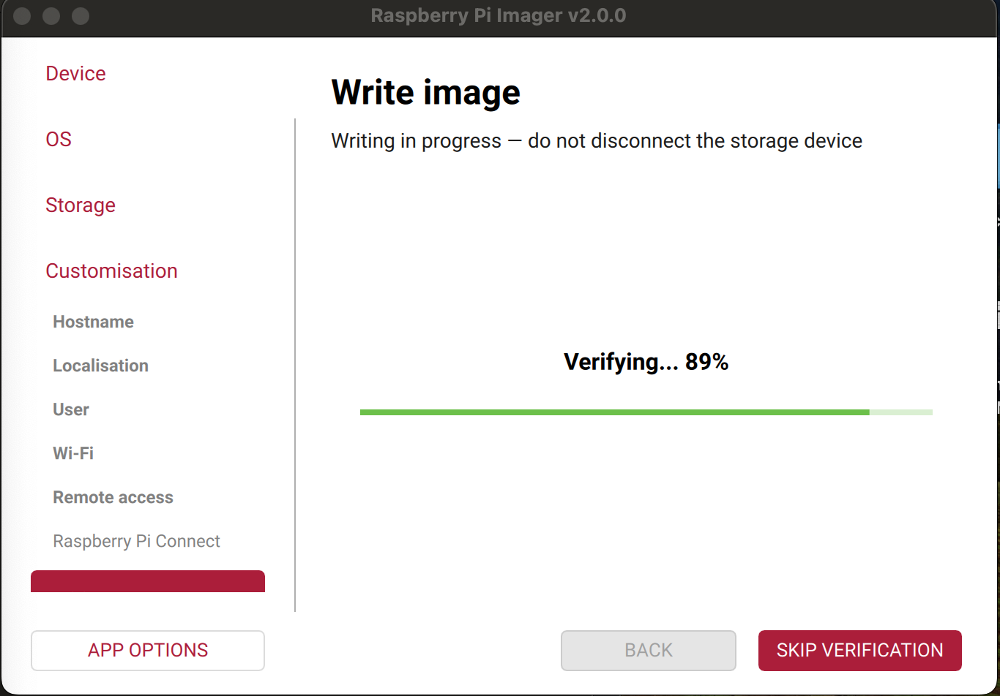
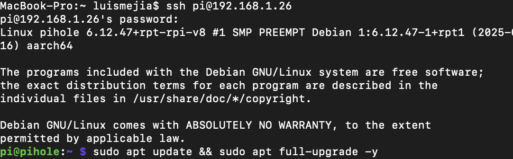
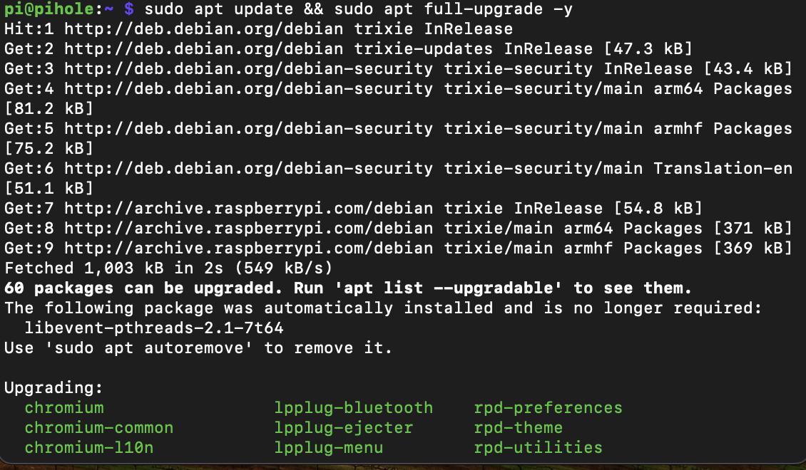
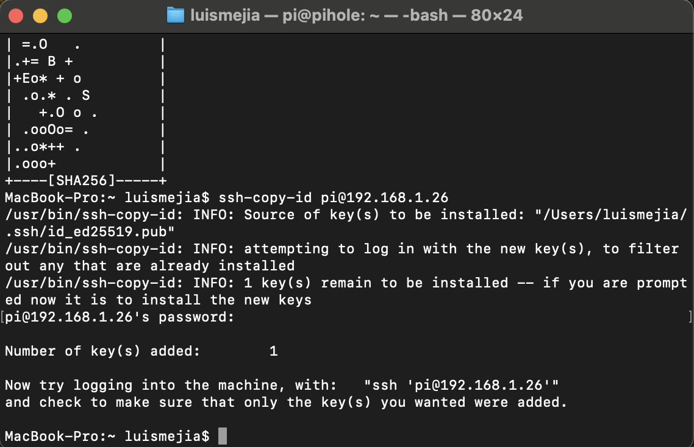
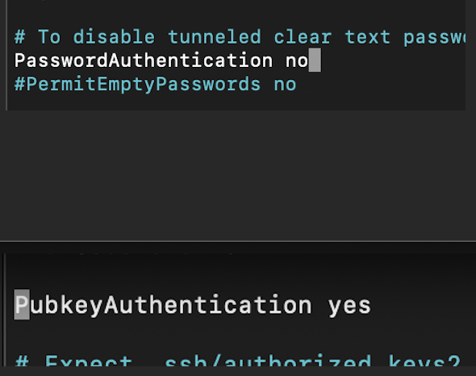

# Lab 1 — Raspberry Pi Initial Setup & Secure SSH Configuration

This lab covers the complete setup of a Raspberry Pi from initial flashing to securing the system with SSH hardening. It prepares the Pi for future labs such as file server configuration, firewall hardening, and Pi-hole.

---

## Objectives
- Flash Raspberry Pi OS  
- Configure localization settings  
- Complete first-boot updates  
- Enable and secure SSH  
- Configure static IP  
- Enable firewall and apply basic system hardening  

---

## System Used
- Raspberry Pi 4 Model B (8GB)  
- Raspberry Pi OS (64-bit)  
- macOS host system  
- Netgear R8000P router  

---

## Screenshots

### 1. Device Selection  

### 2. OS Selection  

### 3. Localization Settings  

### 4. Write Verification  

### 5. Flash Complete  

### 6. First Login via SSH (macOS Terminal)  

### 7. System Update  

### 8. Static IP Configuration  

### 9. Firewall Enabled  

### 10. SSH Key Installed  

### 11. SSH Hardening Complete  

---

