# 🏗️ Raspberry Pi Lab 2 — Samba File Server (Actual Steps Performed)

This lab documents the exact process used to configure a Raspberry Pi as a Samba file server, including macOS and Windows verification. All screenshots included reflect the real workflow executed.

---

# **Step 1 — Update & Upgrade the Raspberry Pi**

```bash
sudo apt update && sudo apt upgrade -y
```

**Screenshot:**  
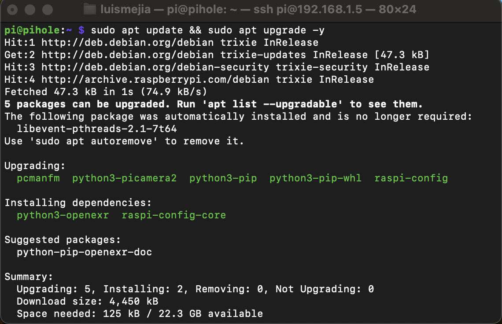

---

# **Step 2 — Install Samba**

```bash
sudo apt install samba -y
```

**Screenshot:**  
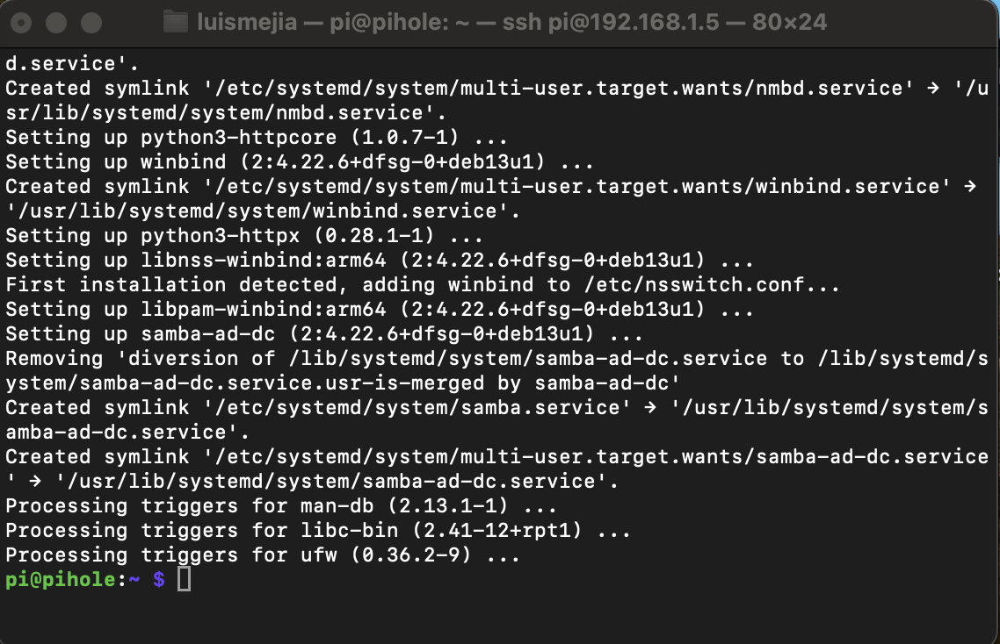

---

# **Step 3 — List All Drives (lsblk)**

This confirms all connected external drives and their mount points.

```bash
lsblk -f
```

**Screenshot:**  
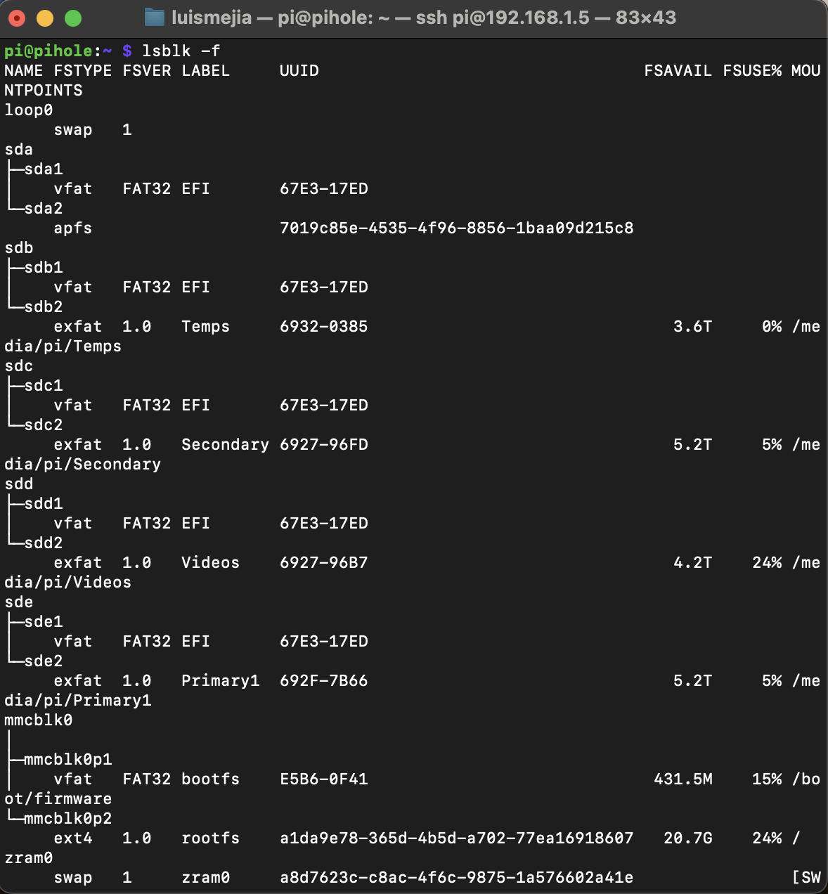

---

# **Step 4 — Apply Permissions to All Drives**

Proper permissions allow Samba users to read/write to shares.

```bash
sudo chown -R pi:pi /media/pi/*
sudo chmod -R 775 /media/pi/*
```

**Screenshot:**  
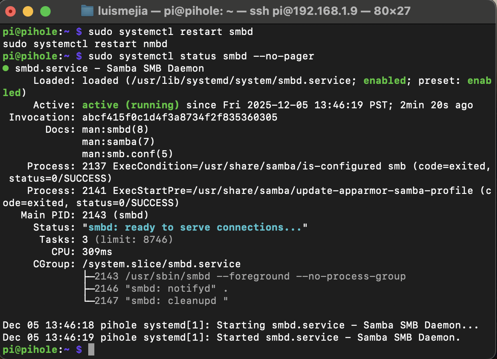

---

# **Step 5 — Edit smb.conf and Add All Shares**

Open Samba config:

```bash
sudo nano /etc/samba/smb.conf
```

Add share definitions for your drives:

```
[Primary1]
   path = /media/pi/Primary1
   browseable = yes
   writable = yes

[Secondary]
   path = /media/pi/Secondary
   browseable = yes
   writable = yes

[Videos]
   path = /media/pi/Videos
   browseable = yes
   writable = yes

[Temps]
   path = /media/pi/Temps
   browseable = yes
   writable = yes
```

**Screenshot:**  
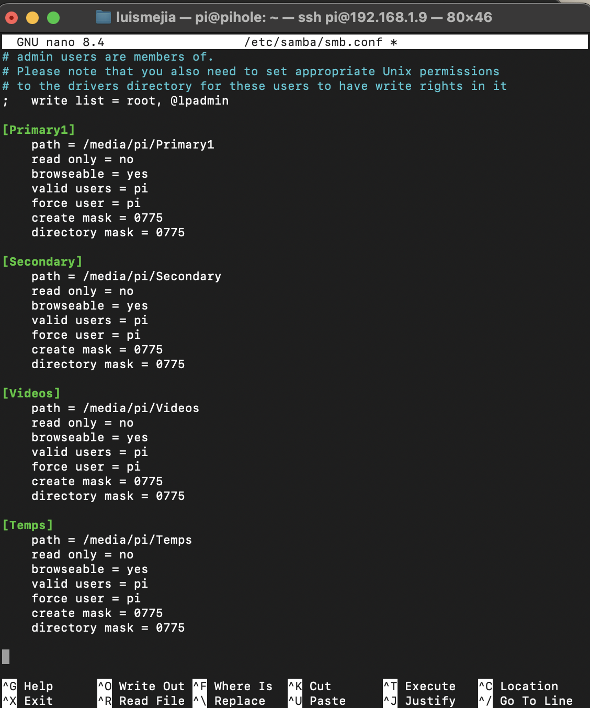

---

# **Step 6 — Restart Samba Services**

```bash
sudo systemctl restart smbd nmbd
sudo systemctl status smbd
```

**Screenshot:**  
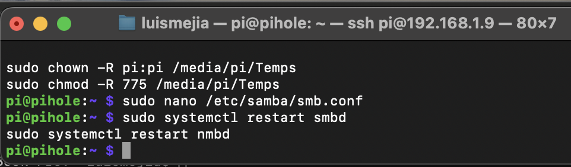

---

# **Step 7 — Create Samba User**

```bash
sudo smbpasswd -a pi
```

**Screenshot:**  
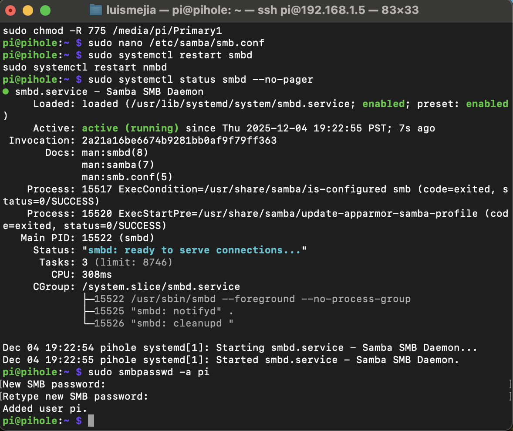

---

# **Step 8 — macOS Finder: View All Shares**

Using Finder → Go → Connect to Server:

```
smb://<your Pi IP>
```

**Screenshot:**  
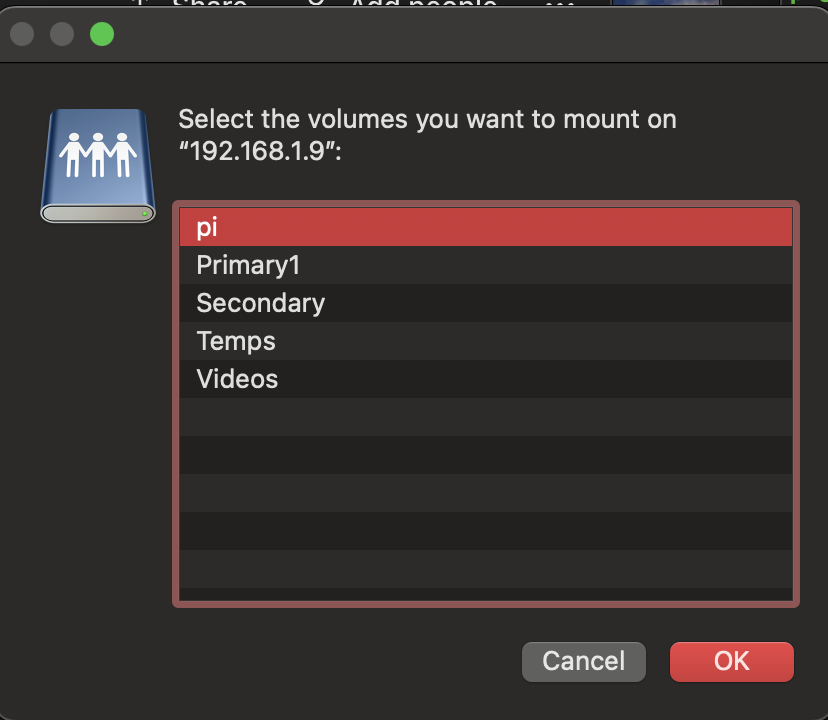

---

# **Step 9 — macOS Create Folder Tests (Write Permission Test)**

These steps confirm macOS can write to each Samba share.

### **Primary1**
**Screenshot:**  
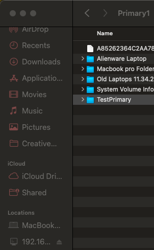

### **Secondary**
**Screenshot:**  
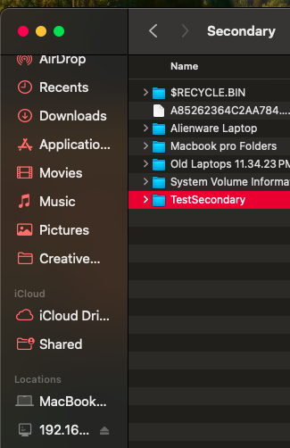

### **Videos**
**Screenshot:**  
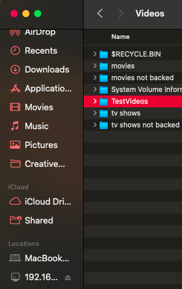

### **Temps**
**Screenshot:**  
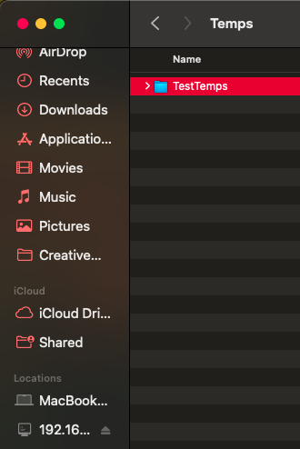

---

# **Step 10 — Windows 11: View All Shares**

Open File Explorer → Address Bar:

```
\\<Pi-IP>
```

**Screenshot:**  
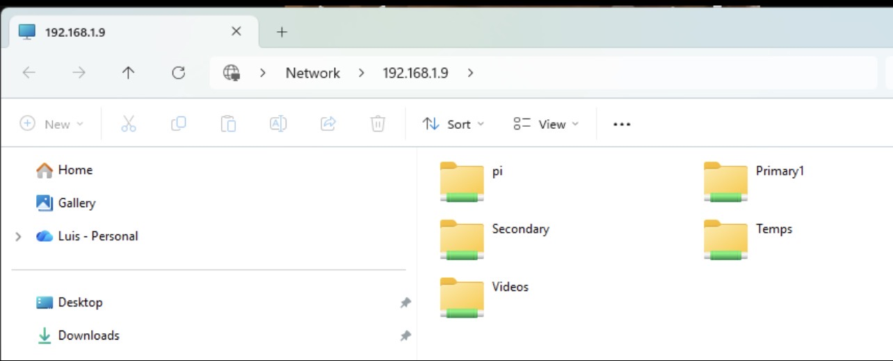

---

# **Step 11 — Raspberry Pi: Verify All macOS/Windows Folder Creations**

```bash
ls /media/pi/* -R
```

**Screenshot:**  
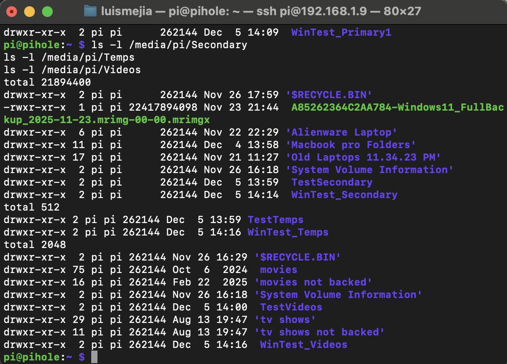

---

# **Step 12 — Windows Write Tests**

These steps confirm Windows can create files/folders on each share.

### **Primary1**
**Screenshot:**  
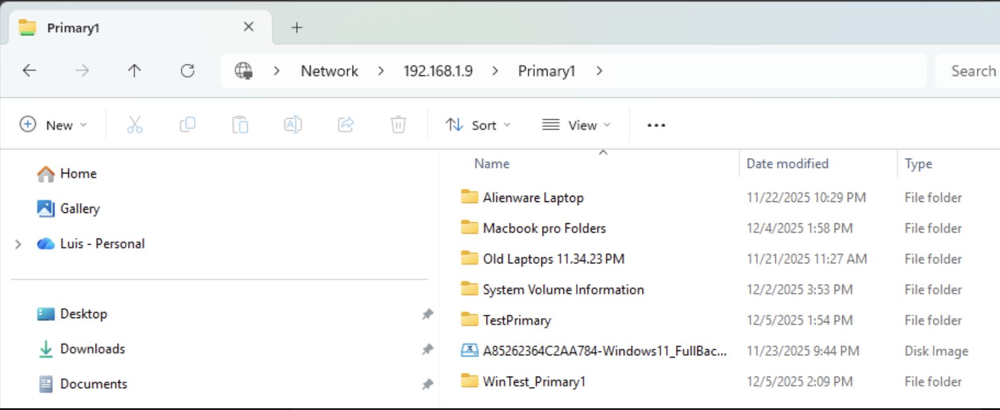

### **Pi verifying Windows write (Primary1)**
**Screenshot:**  
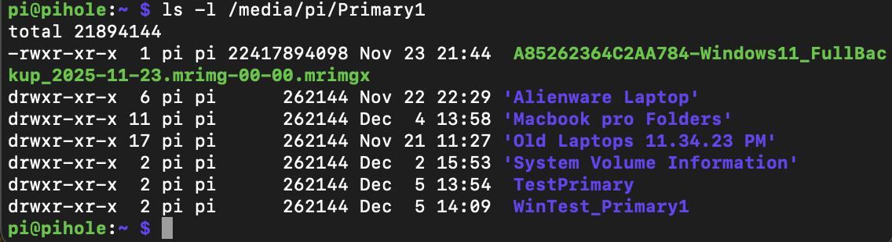

### **Secondary**
**Screenshot:**  
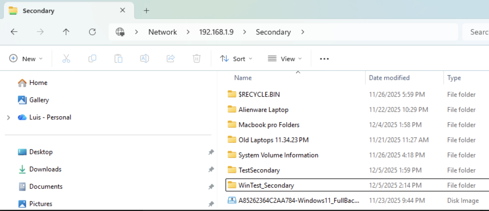

### **Temps**
**Screenshot:**  
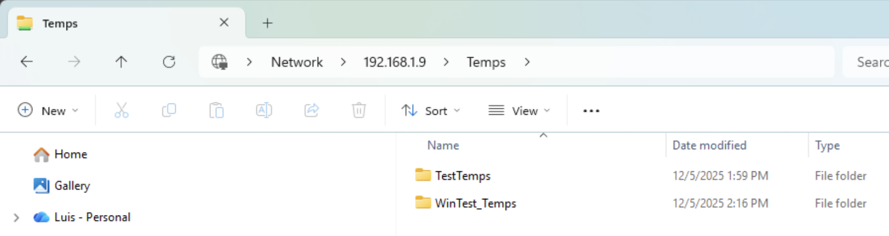

### **Videos**
**Screenshot:**  
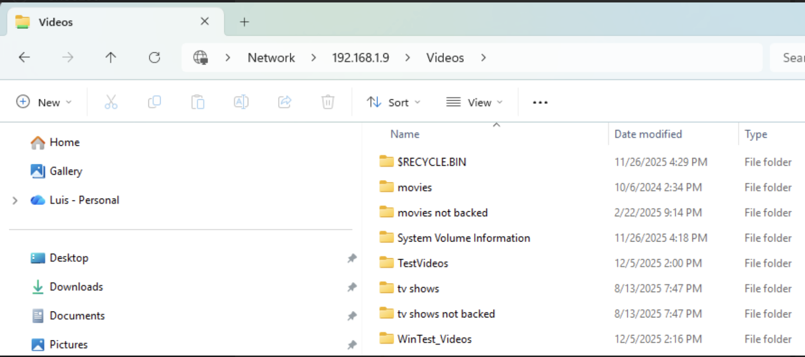

---

# ✅ Summary

You successfully:

- Installed and configured Samba  
- Added full read/write shares  
- Verified macOS read/write functionality  
- Verified Windows 11 read/write functionality  
- Confirmed file creation from both OS types on the Pi  

This Pi is now a fully working Samba file server.

